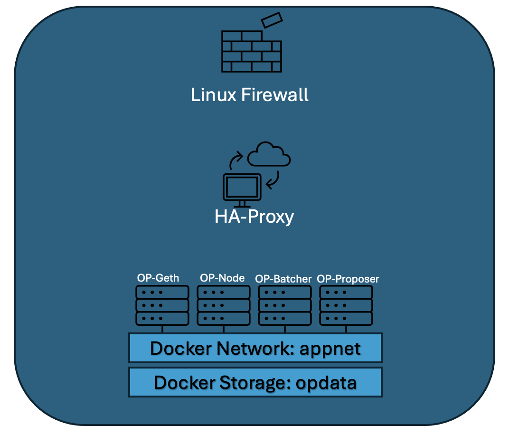

Interval-nodes
=========

This role is used to deploy the OP-Stack node on target servers. It will deploy all the OP-Stack components, including OP-Geth, OP-Node, OP-Batcher, OP-Proposer, and others, as containers on the target servers. All external RPC and WSS traffic will be routed through a reverse proxy using HAProxy. As part of server hardening, we lock down all unrelated ports and only allow P2P and masked RPC/WSS ports for OP-Stack components through the firewall.

Application Design
------------------



Requirements
------------

This role is specifically developed for Linux distributions like Debian and Ubuntu, It is not compatible with other operating systems.

As a prerequisite, place the vault-key.txt file in the .ansible directory. You can find the vault key details in 1Password. 

Also you need to copy your SSH public key to those servers. Use the ssh-copy-id command for this purpose. 

Here’s an example:

```sh
ssh-copy-id user@remote-server
```
During execution, you'll be prompted for the remote server's SSH password. You can retrieve this password from 1Password. If you have any questions or need further assistance, please let me know.

Role Variables
--------------

All environmental variables are encrypted using Ansible Vault to secure sensitive network information. To update any network environmental variables, you need to decrypt the file before making any changes. After updating, re-encrypt the file to maintain security.

Below are the paths to the network variable files for each network:

DevNet: ```opstack-nodes/files/devnet/devnet_vault_secrets.yml```

TestNet: ```opstack-nodes/files/testnet/testnet_vault_secrets.yml```

MainNet: ```opstack-nodes/files/mainnet/mainnet_vault_secrets.yml```

To decrypt the testnet environmental variable file, 

use the following Ansible Vault command:

```sh
cd opstack-nodes
```

```sh
ansible-vault decrypt ./opstack-nodes/files/testnet/testnet_vault_secrets.yml
```

To encrypt the testnet environmental variable file, 

use the following Ansible Vault command:

```sh
cd deploy-infra/ansible
```

```sh
ansible-vault encrypt ./opstack-nodes/files/testnet/testnet_vault_secrets.yml
```

Dependencies
------------

There are a few dependencies before deploying a new OP-Stack node:


Before executing any Ansible tasks, ensure that the vault-key.txt file is placed in the following location. You can obtain this file from 1Password:

```sh
➜  ll ~/.ansible/vault-key.txt 
-rw-r--r--@ 1 draju1980  staff   128B  1 Aug 12:42 /Users/draju1980/.ansible/vault-key.txt
```

Generate Peer ID and Node P2P Private Key:

Use the ./scripts/generate_keys.sh script to generate the keys.

Example:
```sh 
➜  ansible git:main ✗ ./scripts/generate_keys.sh 
Choose an option:
1. Generate OP_NODE_P2P_PRIV and PEER_ID
2. Generate hostname of length 12
Enter 1 or 2 :  1                                   
peerid: 8e44069e9ab293a9b553c2907577f45b3a59525610bbc0ac60
node_p2p_priv: 954de9b98c36f297717d1c68abde0a6486bacba476443ed31d81b7c1c643700d
```

Update Ansible Inventory File:

Add the generated values to the inventory file ( inventory.yml ).

Example:

```sh
devnet-host2:
  ansible_host: 192.168.1.102
  network: devnet
  peerid: 8e44069e9ab293a9b553c2907577f45b3a59525610bbc0ac60
  node_p2p_priv: 954de9b98c36f297717d1c68abde0a6486bacba476443ed31d81b7c1c643700d  
  sequencer: false
```

Configure Sequencer:

Ensure there is only one sequencer in any network (devnet, testnet, mainnet). 
In the Ansible inventory file, 
set sequencer: false for all other nodes in the network.

How to use this role
----------------

Once all prerequisites and dependencies are completed, 

Clone the deploy-infra repository using the following git clone command:

```sh
git clone https://github.com/interval-network/deploy-infra.git
```

Then, change the directory to deploy-infra/ansible:

```sh
cd deploy-infra/ansible
```


Use the following command to start the Ansible task for deploying new servers or updating existing ones:

```sh
ansible-playbook -i opstack-nodes/inventory/inventory.yml opstack-nodes/tasks/main.yml
```

Run a Playbook for a Specific Host

If you want to run the playbook for a specific host, say devnet-host2, 

use:
```sh
ansible-playbook -i opstack-nodes/inventory/inventory.yml opstack-nodes/tasks/main.yml --limit devnet-host2
```

Run a Playbook for a Specific Group

If you want to target a specific group, say devnet,

use:
```sh
ansible-playbook -i opstack-nodes/inventory/inventory.yml opstack-nodes/tasks/main.yml --limit devnet
```

Running a Playbook for a Specific Tag
When a role is tagged with every component, you can execute specific components by using the appropriate tag. Make sure to import all necessary variables to avoid runtime errors.

Example
To run only the grafana task, use the following command:

use:
```sh
ansible-playbook -i opstack-nodes/inventory/inventory.yml opstack-nodes/tasks/main.yml --tags env_vars,network_vars,main_vars,grafana
```

In this example:

* env_vars, network_vars, and main_vars are the variable tags you need to include to ensure all required variables are imported.
* grafana is the specific tag for the component you want to execute.

Make sure to adjust the tags according to the specific components you need to run.

License
-------

BSD

Author Information
------------------

An optional section for the role authors to include contact information, or a website (HTML is not allowed).
